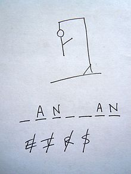
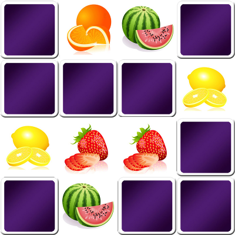
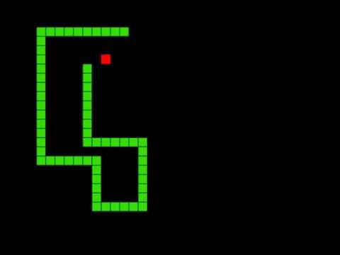
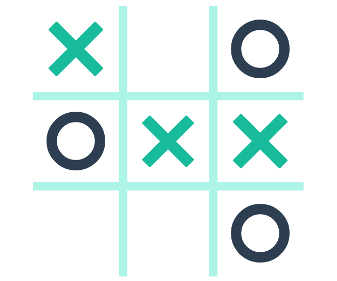

# LW1_Webdev
Modulübergreifendes Projekt für M133, M152 und M307


# Projektbeschreibung Erste Lehrwerkstatt

## Ziel

Lernende vertiefen selbstständig Kenntnisse und trainieren Fähigkeiten aus den Web-Modulen M133, M152 und M307 anhand eines praktischen Webprojektes.
Zusätzlich werden Erfahrungen in Team- und Projektarbeit gesammelt und die Dokumentation des täglichen Arbeitsfortschritts in Hinblick auf die IPA trainiert.

## Zeitraum

  Mo, 16.9. 13:00 - 16:15<br>
  Di, 17.9. 08:30 - 12:00<br>
  Mi, 18.9. 13:00 - 16:15<br>

  Mo, 23.9. 13:00 - 16:15<br>
  Di, 24.9. 08:30 - 12:00<br>
  Mi, 25.9. 13:00 - 16:15<br>
  Mi, 23.10. 13:00 Präsentation

  **total**: 6 x 4 = 24 Lektionen; ca. 18 Stunden a 8 Personen (ohne Präsentation)

## Projektbeschreibung

Sie erstellen einen prototypischen Webauftritt für Spiele-Klassiker (Snake, Memory, Tic-Tac-Toe, Hangman). Von der Startseite können die Spieler auf die jeweiligen Spiele-Seiten navigieren. Damit können Sie relativ unabhängig voneinander an den Teilprojekten arbeiten.

Es wird grosser Wert auf ein einheitliches Design aller Seiten des Webauftritts gelegt. Am Ende des Projekts präsentieren Sie Ihren Webauftritt (dem Auftraggeber / der Schulleitung) und reflektieren dabei die geleistete Arbeit.

## Funktionale Anforderungen

Stufe 1: Die Spiele werden browserseitig mit JavaScript bzw. JQuery programmiert.

Stufe 2: Für jedes Spiel wird serverseitig eine Highscore-Liste gepflegt. Die besten zehn Einträge werden am Ende jedes Spiels angezeigt. Hat der Spieler ein Ergebnis unter den ersten zehn Einträgen erreicht, kann er seinen Namen angeben. Der neue Highscore wird dann serverseitig gespeichert.

Stufe 3: Snake, Tic-Tac-To und Memory können erst gespielt werden, wenn vorab ein Fachbegriff mit Hangman erraten wurde. :-)

## Nichtfunktionale Anforderungen und Rahmenbedingungen

1. Für das Projekt erstellen Sie gemeinsam einen Arbeitsplan.
1. Das Projekt muss auf einem Apache-Webserver ausführbar sein.
2. Idealerweise nutzen Sie ein gemeinsames Code-Repository (am einfachstem mit einem Github-Repo).
2. Es gibt eine Installations- bzw. Betriebsanleitung - idealerweise im Github-Wiki
3. Der erstellte Code wird im nützlichen Umfang inline dokumentiert.
4. Für aus dem Internet kopierte Codesnippets (nur kleinere Fragmente) geben Sie die Quellen im Code an.


## Vorgehen

1. Bestimmen Sie zunächst, wer das Team leiten soll. Die Teamleitung bewahrt den Überblick über den Fortschritt der Teilaufgaben. Bei ernsten Problemen kann die Teamleitung Hilfe beim Auftraggeber suchen. Selbstverständlich darf die Teamleitung auch aktiv programmieren.

2. Überlegen Sie,

    - welche Aufgaben es gibt und wie die Minimal-Version dafür aussehen könnte (damit verringern Sie die Gefahr, sich zu verzetteln)
    - wie die Teilaufgaben getestet werden
    - wie lange diese Aufgaben etwa dauern
    - in welcher Reihenfolge welche Teammitglieder diese Aufgaben ausführen. Arbeiten Sie paarweise oder zu dritt, so dass sich Ihre Stärken ergänzen.
    - Nutzen Sie zur Planung allenfalls das Github-Projekt oder GANTT-Diagramme. Das ist Ihr (vorläufiger) Arbeitsplan.

3. Zu Beginn jedes 4-Lektionen Blocks trifft sich das Team, um kurz (max. 15 Minuten) das Projekt zu besprechen. Jedes Teammitglied beantwortet für alle folgende Fragen:
  - Was habe ich zuletzt erreicht?
  - Was macht Probleme?
  - Was mache ich heute?
  
  Teammitglieder unterstützen einander bei allfälligen Probleme **nach** dem Meeting.
  
3. Jedes Teammitglied notiert Arbeitsfortschritt und eventuell aufgetretene Probleme am Ende jedes Halbtags.

4. Alle Lernenden tragen zum Projektfortschritt bei. Allfällige Probleme werden offen und höflich im Team geklärt.

## Anforderungen und Hinweise: Hangman

Mit dem *Hangman* Spiel sollen Fachbegriffe verschiedener Informatik-Module abgefragt werden. Beim Start des Spiels kann der Benutzer zunächst das Modul auswählen. Für jedes gefragte Wort wird ein Hinweis angezeigt, um welchen Fachbegriff es sich handelt.

Hier ein paar Beispiele für *M403*:
* Datentyp: eine Komponente der Variablendeklaration
* Variablenname: eine Komponente Variablendeklaration
* Parameterliste: Bestandteil vom Funktionskopf
* Rückgabetyp: Bestandteil Funktionskopf

In den Modulen 101, 104, 105, 226A, 152, 133 und 307 haben Sie etliche weitere Fachbegriffe gelernt.



### Hinweise

1. Speichern Sie die Fachbegriffe und Begleittext je Modul zunächst in einem (verschachteltem) JS-Dictionary ab. Das nachfolgende Snippet zeigt auch den Code zum Auswählen eines zu erratenden Begriffs (word2Guess) und dessen Begleittext (description).

  ```javascript
  var hangman_dictionary = {
    "M403": { "Datentyp": "eine Komponente der Variablendeklaration",
      "Variablenname": "eine Komponente Variablendeklaration",
      "Parameterliste": "Bestandteil vom Funktionskopf",
      "Rückgabetyp": "Bestandteil Funktionskopf"},
    "M226A": { "Klasse": "Bauplan für gleichartige Objekte",
      "Objekt": "Ausprägung bzw. Instanz einer Klasse",
      "Konstruktor": "Klassenfunktion zum Erstellen eines Objekts"
    }
  };

  var keys = Object.keys(hangman_dictionary["M403"]);
  var word2Guess = hangman_dictionary["M403"][Math.random() * keys.length];
  var description = hangman_dictionary["M403"][word2Guess];
  ```

2. Auf die einzelnen Buchstaben einer Zeichenkette greifen Sie mit dem Index-Operator zu:

  ```javascript
  word = "Attribut";
  for (var i=0; i < word.length; i++){
    console.log(word[i]);
  }
  ```

3. Das folgende Snippet prüft, an welchen Stellen ein Buchstabe in einem Wort vorkommt:

  ```javascript
  var findMe = function(word, eingabe){
    var index = word.indexOf(eingabe, index);
    var zaehler = 0;
    while (index >= 0){
      console.log("'"+eingabe + "'" + " gefunden an Pos:" +index);
      index = word.indexOf(eingabe, index+1);
      zaehler++;
    }
    return zaehler;
  }

  var word = "Attribut";
  if (findMe(word, "z")==0){
    console.log("z wurde nicht gefunden.")
  }
  findMe(word, "t");
  ```

4. Die verschiedenen Hangman-Zustände können Sie :

  * mit unterschiedlichen Bilddateien realisieren
  * oder in einem HTML5-canvas Element dynamisch zeichnen [https://www.w3schools.com/graphics/canvas_drawing.asp](https://www.w3schools.com/graphics/canvas_drawing.asp)

5. Am Schluss können Sie eventuell die Daten in eine Datenbank migrieren und ein zufälliges (word2Guess-description) per AJAX-Call abrufen.


## Anforderungen und Hinweise: Memory

Das Memory-Spiel trainiert das Kurzzeitgedächtnis. Die Spielkarten für das Memory können Sie beispielsweise mit Glyphs oder GIFs in einem Bootstrap-Grid realisieren. Entsprechend der Spielelogik werden maximal zwei Karten gleichzeitig aufgedeckt. Sind zwei gleichartige Karten aufgedeckt, bleiben diese offen. Andernfalls werden beide Karten wieder verdeckt.




## Anforderungen und exemplarische Planung Snake

Für das Snake-Spiel nutzen Sie ein HTML5-Canvas-Element. Inspirationen können Sie sich gerne holen unter: [https://www.w3schools.com/graphics/game_images.asp](https://www.w3schools.com/graphics/game_images.asp)



Fehlt eigentlich nur noch der Event-Listener, um die Schlange mit Pfeiltasten zu bewegen - und es biz Spielelogik...

Der Punktestand ergibt sich aus der Länge der Schlange.

## Anforderungen und Hinweise: Tic-Tac-Toe

Ein Spiel für zwei Benutzer. Wer am Zug ist sollte gut sichtbar gemacht werden. Zusatz: Entwickeln Sie eine KI, damit das Spiel auch alleine gespielt werden kann!



Viel Erfolg!
